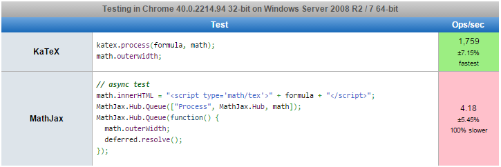
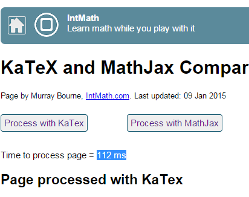
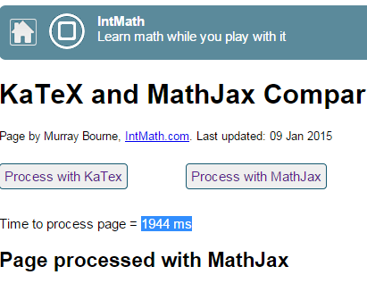
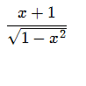
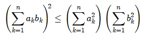
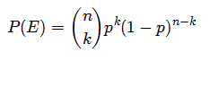

```{r "setup",echo=F}
### get knitr just the way we like it

knitr::opts_chunk$set(
  message = FALSE
  , warning = FALSE
  , error = FALSE
  , tidy = FALSE
  , cache = FALSE
  #, results = 'asis'
)

library(pipeR)
```

## htmlwidgets News This Week
@jcheng5 from RStudio

-[\@jcheng5](https://github.com/jcheng5) - d3 bubble chart [`bubbles`](https://github.com/jcheng5/bubbles) demonstrated live in a simulated dashboard at this [DataScience.LA meetup](http://datascience.la/la-r-meetup-january-21-rstudios-shiny-with-joe-cheng/).


## This Week's Widget - `katexR` | KaTeX rendering for R

I'm guessing your first question will be something like this.

> With MathJax and LaTeX, why the **#$&)** do we need another math / formula renderer?

Well, the simple answer is speed, but unfortunately the **need for speed requires a sacrifice for completeness**, so choose with care (see this [list for function support](https://github.com/Khan/KaTeX/wiki/Function-Support-in-KaTeX) ).  The speed boost is huge though.  Here is a [jsperf comparison](http://jsperf.com/katex-vs-mathjax) run on my machine.



And, another comparison courtesy of [IntMath](http://www.intmath.com/cg5/katex-mathjax-comparison.php?processor=MathJax).





## Examples

Unfortunately, on this blog, I cannot post the result directly, so I have resorted to screenshots for the simple examples in this post.  I'll use the painful but typical `<iframe>` for the later examples of `katexR` in `rmarkdown`.

**note: you'll need an extra \\ to escape special characters**

### Simple Examples

```{r "example01",eval = F}
# not on CRAN, so install with devtools
#  devtools::install_github("timelyportfolio/katexR")
library(katexR)

katexR("x+1\\over\\sqrt{1-x^2}")
```



To see the similarity of `KaTeX` with MathJax and `LaTeX`, let's use some examples from the MathJax [examples](http://cdn.mathjax.org/mathjax/latest/test/sample.html).  Here is the `Cauchy-Schwarz Inequality`.

```{r "example02", eval = F}
# using MathJax example
#   http://cdn.mathjax.org/mathjax/latest/test/sample.html
katexR("\\left( \\sum_{k=1}^n a_k b_k \\right)^{\\!\\!2} \\leq
 \\left( \\sum_{k=1}^n a_k^2 \\right) \\left( \\sum_{k=1}^n b_k^2 \\right)")
```



For one more, let's do the probably of a coin toss example.

```{r "example03", eval = F}
# using MathJax example
#   http://cdn.mathjax.org/mathjax/latest/test/sample.html
katexR("P(E) = {n \\choose k} p^k (1-p)^{ n-k}")
```



### In Markdown

I imagine that if you start using `katexR` you'll most likely want to use it in a `rmarkdown` context for publication of research or presentations.  I have embedded the rendered `katexR` [example](https://github.com/timelyportfolio/katexR/blob/master/inst/examples/examples.Rmd) below to prove that `katexR` works just fine in `rmarkdown`.

<iframe src = "http://timelyportfolio.github.io/buildingwidgets/week05/examples.html" seamless height = 500px width = 100% style = "border:none;"></iframe>

## Thanks

Thanks so much for all the work by

- Khan Academy for educating all of us and open-sourcing their Javascript
- Ramnath Vaidyanathan and RStudio for `htmlwidgets`
